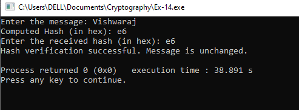

# EX-NO-14-HASH-ALGORITHM

## AIM:
To implement HASH ALGORITHM

## ALGORITHM:

1. Hash Algorithm is used to convert input data (message) into a fixed-size string, typically a hash value, which uniquely represents the original data.

2. Initialization:
   - Choose a hash function \( H \) (e.g., SHA-256, MD5, etc.).
   - The message \( M \) to be hashed is input.

3. Message Preprocessing:
   - Break the message \( M \) into fixed-size blocks. If necessary, pad the message to make it compatible with the block size required by the hash function.
   - For example, in SHA-256, the message is padded to ensure that its length is a multiple of 512 bits.

4. Hash Calculation:
   - Process the message block by block, applying the hash function \( H \) iteratively to produce an intermediate hash value.
   - For SHA-256, each block is processed through a series of logical operations, bitwise manipulations, and modular additions.

5. Output:
   - After all blocks are processed, the final hash value (digest) is produced, which is a fixed-size output (e.g., 256-bit for SHA-256).
   - The resulting hash is unique to the input message, meaning even a small change in the message will result in a completely different hash.

6. Security: The strength of the hash algorithm lies in its collision resistance, ensuring that it is computationally infeasible to find two different messages that produce the same hash value.


## Program:
```
#include <stdio.h>
#include <string.h>

// Function to compute a simple hash using XOR and addition
void computeSimpleHash(const char *message, unsigned char *hash) {
    unsigned char temp = 0;

    // Simple hash computation: XOR and addition
    for (int i = 0; message[i] != '\0'; i++) {
        temp = temp ^ message[i];  // XOR each character
        temp += message[i];        // Add each character's value
    }

    // Store the result in the hash
    *hash = temp;
}

int main() {
    char message[256];      // Buffer for the input message
    unsigned char hash;     // Buffer for the hash (only 1 byte for simplicity)
    char receivedHash[3];   // Buffer for input of received hash (in hex format)

    // Step 1: Input the message
    printf("Enter the message: ");
    scanf("%s", message);

    // Step 2: Compute the simple hash
    computeSimpleHash(message, &hash);

    // Step 3: Display the computed hash in hexadecimal format
    printf("Computed Hash (in hex): %02x\n", hash);

    // Optional Step 5: Verify the hash
    printf("Enter the received hash (in hex): ");
    scanf("%s", receivedHash);

    // Convert received hash from hex string to an unsigned char
    unsigned int receivedHashValue;
    sscanf(receivedHash, "%02x", &receivedHashValue);

    // Compare the computed hash with the received hash
    if (hash == receivedHashValue) {
        printf("Hash verification successful. Message is unchanged.\n");
    } else {
        printf("Hash verification failed. Message has been altered.\n");
    }

    return 0;
}
```
## Output:

## Result:
The program is executed successfully.
